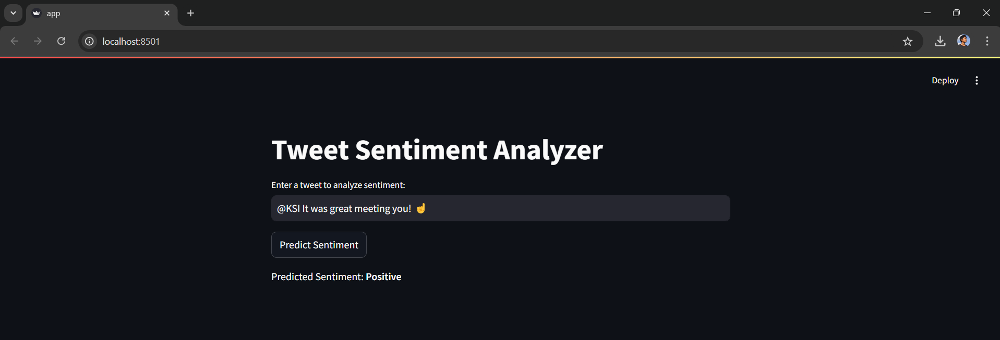
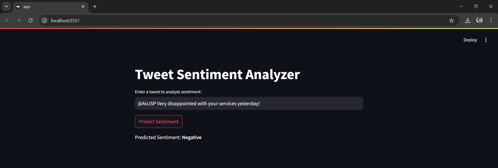

# Twitter Sentiment Analysis

A sentiment analysis project using Natural Language Processing (NLP) to classify tweets as positive or negative, with a simple GUI built using Streamlit.

## Features

- Sentiment prediction for tweets.
- Web-based interface via **Streamlit**.
- Preprocessing of tweet text (removal of mentions, URLs, and special characters).
- Pre-trained model using logistic regression and TF-IDF vectorization.

## Installation

1. Clone the repository:
   ```bash
   git clone https://github.com/your-username/twitter-sentiment-analysis.git
   ```
2. Install required libraries:
   ```bash
   pip install -r requirements.txt
   ```
3. Run the app:
   ```bash
   streamlit run app.py
   ```
   
### Screenshots




## Usage

- Enter a tweet in the input box to analyze sentiment (positive or negative).

## Future Enhancements

- Multi-language tweet analysis.
- Real-time tweet analysis using the Twitter API.
